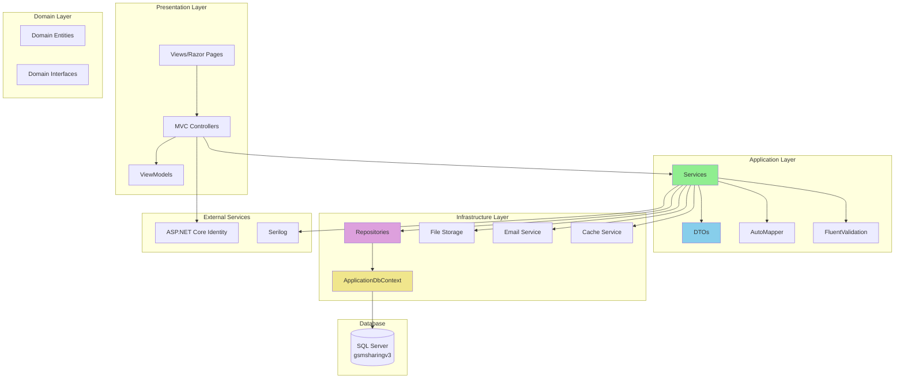
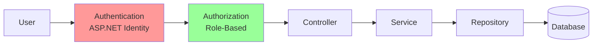

# 🏗️ Architecture Diagram
## GSMSharing V2 - Current & Target Architecture

**Date:** December 2024  
**Status:** Phase 0 Complete

---

## 📊 Current Architecture

```mermaid
graph TB
    subgraph "Presentation Layer"
        Views[Views/Razor Pages]
        Controllers[Controllers]
    end
    
    subgraph "Business Logic Layer"
        Repositories[Repositories]
    end
    
    subgraph "Data Access Layer"
        DbContext[ApplicationDbContext]
    end
    
    subgraph "Database"
        SQLServer[(SQL Server<br/>gsmsharingv3)]
    end
    
    subgraph "Identity"
        Identity[ASP.NET Core Identity]
    end
    
    Views --> Controllers
    Controllers --> Repositories
    Repositories --> DbContext
    DbContext --> SQLServer
    Controllers --> Identity
    Identity --> SQLServer
    
    style Controllers fill:#ffcccc
    style Repositories fill:#ccffcc
    style DbContext fill:#ccccff
    style SQLServer fill:#ffffcc
```

### Current Architecture Issues
- ❌ Business logic in controllers
- ❌ No service layer
- ❌ Direct model usage in views
- ❌ No DTOs/ViewModels
- ❌ Basic error handling

---

## 🎯 Target Architecture (Phase 1+)



---

## 🔄 Data Flow

### Current Flow (Before Modernization)
```
User Request → Controller → Repository → DbContext → Database
                ↓
              Model → View
```

### Target Flow (After Modernization)
```
User Request → Controller → Service → Repository → DbContext → Database
                ↓            ↓
            ViewModel    DTO → Entity
                ↓
              View
```

---

## 📦 Layer Responsibilities

### Presentation Layer (Controllers & Views)
- **Responsibility:** Handle HTTP requests/responses
- **Contains:** Controllers, Views, ViewModels
- **Dependencies:** Application Layer only

### Application Layer (Services)
- **Responsibility:** Business logic, use cases
- **Contains:** Services, DTOs, Validators
- **Dependencies:** Domain Layer

### Domain Layer (Entities)
- **Responsibility:** Business entities and rules
- **Contains:** Entities, Value Objects, Domain Interfaces
- **Dependencies:** None (pure C#)

### Infrastructure Layer (Data Access)
- **Responsibility:** External concerns (database, file storage)
- **Contains:** Repositories, DbContext, External Services
- **Dependencies:** Application & Domain Layers

---

## 🔐 Security Architecture



---

## 📊 Component Diagram

### Core Components

```
┌─────────────────────────────────────────────────────────┐
│                    GSMSharing V2                       │
├─────────────────────────────────────────────────────────┤
│                                                         │
│  ┌──────────────┐  ┌──────────────┐  ┌─────────────┐ │
│  │   Posts      │  │  Communities │  │   Forum     │ │
│  │  Controller  │  │  Controller  │  │ Controller  │ │
│  └──────┬───────┘  └──────┬───────┘  └──────┬──────┘ │
│         │                 │                  │        │
│  ┌──────▼─────────────────▼──────────────────▼──────┐ │
│  │              Service Layer                        │ │
│  │  PostService │ CommunityService │ ForumService  │ │
│  └──────┬───────────────────────────────────────────┘ │
│         │                                              │
│  ┌──────▼───────────────────────────────────────────┐ │
│  │           Repository Layer                        │ │
│  │  PostRepository │ CommunityRepository │ etc.     │ │
│  └──────┬───────────────────────────────────────────┘ │
│         │                                              │
│  ┌──────▼───────────────────────────────────────────┐ │
│  │         ApplicationDbContext                      │ │
│  └──────┬───────────────────────────────────────────┘ │
│         │                                              │
│  ┌──────▼───────────────────────────────────────────┐ │
│  │            SQL Server Database                    │ │
│  └──────────────────────────────────────────────────┘ │
│                                                         │
└─────────────────────────────────────────────────────────┘
```

---

## 🔄 Request/Response Flow

### Example: Creating a Post

```
1. User submits form
   ↓
2. PostsController.Create() receives request
   ↓
3. Controller validates ViewModel
   ↓
4. Controller calls PostService.CreateAsync()
   ↓
5. Service validates DTO
   ↓
6. Service maps DTO to Entity (AutoMapper)
   ↓
7. Service calls PostRepository.CreateAsync()
   ↓
8. Repository saves to database via DbContext
   ↓
9. Service maps Entity to DTO
   ↓
10. Controller maps DTO to ViewModel
   ↓
11. Controller returns View with ViewModel
   ↓
12. View renders HTML
```

---

## 📁 Project Structure

### Current Structure
```
GsmsharingV2/
├── Controllers/
├── Models/
├── Views/
├── Database/
├── Repositories/
└── Interfaces/
```

### Target Structure (Phase 1+)
```
GsmsharingV2/
├── Controllers/
├── Views/
├── ViewModels/
├── Services/
│   ├── Interfaces/
│   └── Implementations/
├── DTOs/
├── Repositories/
│   ├── Interfaces/
│   └── Implementations/
├── Database/
├── Models/ (Domain Entities)
├── Mappings/ (AutoMapper)
├── Exceptions/
└── Middleware/
```

---

## 🎯 Architecture Principles

### SOLID Principles
- **S**ingle Responsibility: Each class has one reason to change
- **O**pen/Closed: Open for extension, closed for modification
- **L**iskov Substitution: Derived classes must be substitutable
- **I**nterface Segregation: Many specific interfaces
- **D**ependency Inversion: Depend on abstractions

### Clean Architecture
- **Dependency Rule:** Dependencies point inward
- **Separation of Concerns:** Each layer has distinct responsibility
- **Testability:** Easy to test in isolation

---

**Last Updated:** December 2024  
**Status:** Phase 0 Complete

---

**End of Architecture Diagram**

